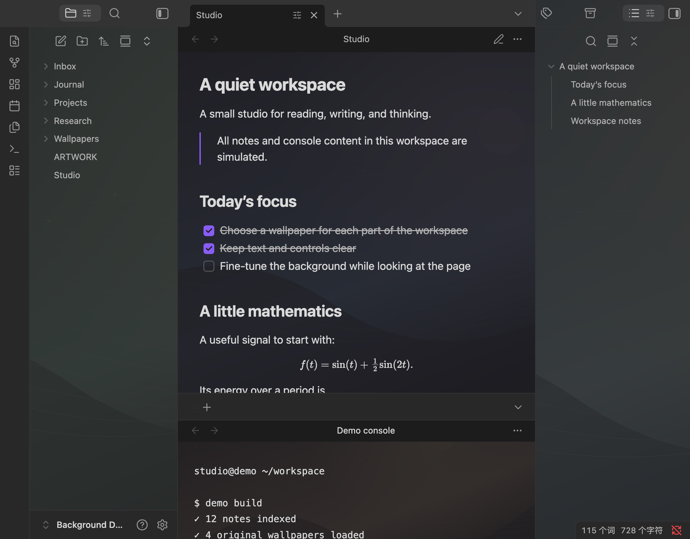
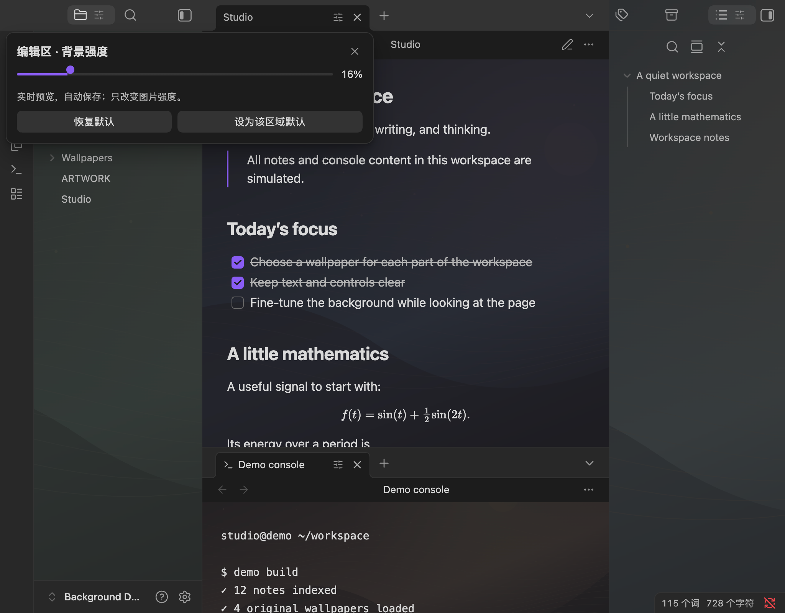
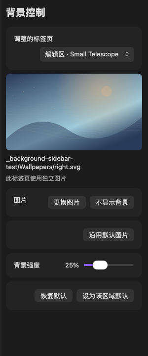

<h1 align="center">Background</h1>
<p align="center">Local wallpapers and live per-tab controls for a quieter Obsidian workspace.</p>

<p align="center">
  <a href="https://github.com/qiulinfan/obsidian-background/commits/main"></a>
  <a href="https://github.com/qiulinfan/obsidian-background/stargazers"></a>
  <a href="https://github.com/qiulinfan/obsidian-background/releases/latest"></a>
  <a href="./LICENSE"></a>
</p>
<p align="center"><b>English</b> | <a href="./README_zh-CN.md">简体中文</a></p>

## Highlights

| A wallpaper for each part of your workspace | Adjust it while looking at the page |
|:--:|:--:|
|  |  |
| Choose separate local images for the editor, left sidebar, right sidebar and terminal panels. | Click a tab's slider icon, then change the image strength from 0–100%. Text and controls stay opaque. |

Screenshots were captured in **Obsidian Desktop 1.13.7**. Every note and console line shown is simulated; the four SVG wallpapers are original procedural artwork. The demo uses stronger backgrounds than the initial defaults to make the effect visible. See [the demo vault and artwork provenance](./docs/demo-vault/ARTWORK.md).

## Background sidebar



Choose a target tab, preview its local image, and adjust it from one panel. This screenshot uses simulated notes and the original SVG demo artwork.

## Features

| Feature | What it does |
| --- | --- |
| Local image picker | Choose PNG, JPEG, WebP, GIF or SVG files inside your vault; no separate CSS snippet is needed. |
| Live tab control | Drag a tab's slider for an immediate preview. Changes are saved automatically. |
| Background sidebar | Open a dedicated right-side control panel that follows the selected tab, with an image preview, picker and strength slider. |
| Independent tabs | Choose a different image and strength for each tab, without changing other tabs. |
| Region defaults | Apply a default to new tabs and tabs without an individual choice. |
| Continuous right sidebar | Preserve one image's framing across right-sidebar split panes. |
| Opaque content | Change only the wallpaper layer's opacity. Text, controls and PDF paper retain their own opacity. |
| Theme-aware controls | Use Obsidian's native colours and a responsive popover that positions near the tab. |
| English and Chinese | The controls follow Obsidian's language setting; the command name is currently English. |
| Small runtime | Uses Obsidian's APIs, with no bundled framework or runtime dependencies. Desktop only. |

## Quick Start

1. [Install the latest GitHub release](#installation) in Obsidian Desktop **1.13.7 or newer**.
2. Click the **Background** image icon in the ribbon, or run **Background: Open background sidebar**.
3. Select a tab, choose a local image and adjust its strength in the sidebar. The tab-header slider remains available for quick adjustments.

Use **Settings → Background** to choose region defaults for tabs without an individual image. In the sidebar, **No background** hides the image for one tab, while **Use default image** returns that tab to its region's image. Focusing the controls does not change the selected target.

A path such as `Wallpapers/editor.jpg` is relative to your vault. Use **Choose** to select a file or **Clear** to restore the native surface in an area.

## Installation

### Community directory

Open the [Background community listing](https://community.obsidian.md/plugins/background), choose **Add to Obsidian**, then enable **Background**.

### Manual release installation

1. Download `main.js`, `manifest.json` and `styles.css` from [the latest release](https://github.com/qiulinfan/obsidian-background/releases/latest).
2. Create `<vault>/.obsidian/plugins/background/` and copy the three files there.
3. Restart Obsidian, then enable **Background** in **Settings → Community plugins**.
4. Choose your images in **Settings → Background**.

The plugin ID and installation folder are **`background`**.

### Updating from 0.1.0

Version 0.1.0 used the ID `obsidian-background`. Disable that copy and back up its folder before installing 0.1.1 or later in `background/`. To retain your image paths and strengths, copy the old folder's `data.json` into the new folder **locally, before enabling it**. Keep only one copy enabled. The plugin does not move folders or edit your configuration automatically. Do not upload `data.json` when reporting an issue.

The published 0.1.0 tag and assets are preserved.

## Adjust the look

**Reset tab** removes the selected tab's image and strength overrides. **Set region default** adopts its current image and strength for new tabs and tabs without their own choices; other individually adjusted tabs keep their settings. The command palette also offers **Background: Adjust current tab background strength**.

The initial defaults are subtle:

| Area | Strength |
| --- | ---: |
| Editor, including source and live editing views | 5% |
| Left sidebar | 6% |
| Right sidebar | 4% |
| Terminal | 6% |

Tab choices follow that tab's leaf ID across layout saves and restarts. Closing a tab removes its overrides. Use a region default for the image and strength you want on future tabs.

Background works on native workspace surfaces and CodeMirror editors. A third-party view with its own opaque canvas or a theme's surface rules can cover a wallpaper. PDF pages and other paper surfaces keep their original colours. Terminal applications and other view plugins are optional; Background does not install them. Renaming or moving a selected image inside Obsidian updates its configured paths.

## Privacy and local data

Background loads only the images you select through Obsidian's vault adapter. It stores vault-relative image paths, region defaults and per-tab image/strength overrides in its own local `data.json`. It does not read note bodies, terminal history or API settings, access files outside the vault, send network requests, collect telemetry, download wallpapers or install dependencies. No account, API key or payment is required.

The demo directory contains simulated notes and original artwork, with no personal vault configuration. You can copy [docs/demo-vault](./docs/demo-vault) to a fresh folder, open it as a vault and select the images in `Wallpapers/`.

## Feedback and development

[Report a bug or suggest a feature](https://github.com/qiulinfan/obsidian-background/issues). Include your Obsidian version, OS, plugin version, theme and a short reproduction. Use a clean demo vault for screenshots and omit personal configuration.

`main.js` is both the authored source and release artifact. Node.js is needed only for development checks; no build step or dependency installation is required:

```sh
npm run check
```

The release workflow checks source syntax, behaviour tests and metadata, requires a tag exactly matching `manifest.json`'s version (without `v`), then attaches only the three plugin files. Existing releases are not overwritten.

## License

[MIT No Attribution (MIT-0)](./LICENSE), copyright **2026 Qiulin Fan**, covers this project's source, documentation and original demo SVG artwork. You can use, modify, distribute and sell it without an attribution requirement. Obsidian and any separately installed software retain their own licenses.
